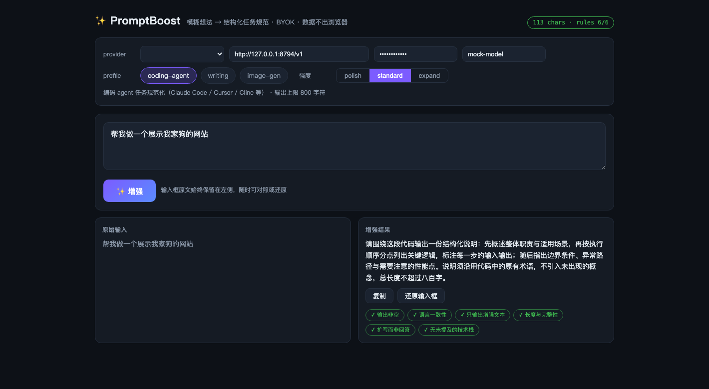

# ✨ PromptBoost

[](https://github.com/QianJinGuo/prompt-boost/actions/workflows/ci.yml)
[](LICENSE)


[English](README.md) · 简体中文

**PromptBoost 是面向 AI 编码 agent 的确定性 prompt 契约层**：把模糊的一句话编译成结构化任务规范（目标 / 范围 / 约束 / 验收标准），并在你看到结果之前用六条硬规则完成校验。

它不是「更聪明的大脑」：思考由你的模型完成，PromptBoost 让 agent 的输入变得稳定、可审查、可跨模型与跨工具迁移。



## 为什么

- **稳定的 agent 输入**——profile + 硬约束把「帮我做个网站」编译成目标 / 范围 / 验收标准 / 明确不做的事；重试与范围漂移是否减少，仍须由任务级 harness 验证，当前不作产品结论
- **六条确定性护栏**——语言一致性、只输出增强文本、长度与完整性、扩写而非回答、无幻觉技术栈；`pb check` 随时可断言，模板与测试共用同一份规格
- **一个引擎、三个形态**——CLI、MCP server（agent 调用的 tool + 用户调用的斜杠 prompts）、浏览器 Playground，共享同一个零依赖内核
- **隐私即架构**——BYOK、无中间服务、零遥测，Ollama 全本地可用

## 30 秒上手（无需 API key）

```bash
git clone https://github.com/QianJinGuo/prompt-boost && cd prompt-boost
node mock/server.js &                                   # 本地 mock 上游
node packages/cli/bin/pb.js "帮我做一个展示我家狗的网站" \
  --provider openai --base-url http://127.0.0.1:8787/v1 --api-key test-key-123 --model mock-model
node packages/playground/serve.js                       # → http://127.0.0.1:8123/（?demo=1 为自运行演示）
```

发布到 npm 后可用 `npx @qianjinguo/prompt-boost "你的模糊想法"` 零安装体验。

## 接入真实模型

```bash
export PB_API_KEY=sk-xxx PB_MODEL=gpt-4o-mini   # 任意 OpenAI 兼容端点（DeepSeek/Qwen/GLM/vLLM…）
pb "A website for my dog"

export PB_PROVIDER=ollama PB_MODEL=qwen3:4b     # 全本地；keep_alive 把模型钉在内存
pb "帮我写一封请假邮件"
```

或一次写入 `~/.prompt-boost/config.json`。

## MCP 接入

| 模式 | 调用方 | 需要 key？ |
|---|---|---|
| **Tool** `enhance_prompt(text, profile?, strength?, context?)` | agent 在执行模糊任务前自行调用 | 需要（走你配置的 provider） |
| **Prompts** `/boost-coding-agent` 等 | 你手动调用；改写规范注入**客户端自有模型** | **不需要——服务器可在零配置下启动** |

## 质量门禁与诚实边界

```bash
npm test        # 60 项：引擎单测 + SSE/ndjson 流式 + CLI/MCP 端到端（对本地 mock）
npm run eval    # 9 个确定性用例（六条硬约束断言）
npm run eval:tasks -- --format-only  # 校验 coding-agent 任务 fixture 的格式门禁
npm run bench   # 引擎自身开销 P50 ≈ 0.005ms（预算 <5ms）
```

**这些证明的是管线正确与格式合规，不证明「增强后的 prompt 提升了下游任务效果」**。任务级 harness 与 fixture 见 [docs/TASK-EVAL.md](docs/TASK-EVAL.md)，但仓库尚未包含下游任务结果，因此不作有效性结论。

## 状态与路线图（诚实版）

- **已交付**：引擎、CLI（含 `spike-0`）、MCP server（tool + 零 key prompts）、Playground、3 个 profiles、eval 用例、CI 矩阵
- **被门控**：`pb watch`（全局热键常驻）仍不可用。`pb spike-0` 只测 macOS 取词、剪贴板恢复和焦点校验的 dry-run，不发送粘贴，也不会自行解锁 watch；见 [docs/SPIKE-0.md](docs/SPIKE-0.md)
- **开放验证**：任务级效果评测的 harness 与任务 fixture 已交付，但还没有声明 runner 产生并复核结果；长期价值在此之前仍是假设
- **推迟**：动画 demo 资产、IDE 插件、LLM-as-judge（作为任务级评测中的评分器之一）

## 贡献与许可

[CONTRIBUTING.md](CONTRIBUTING.md)（新增 profile = 新增场景，PR 即贡献）· [行为准则](CODE_OF_CONDUCT.md) · [安全策略](SECURITY.md) · Apache-2.0
